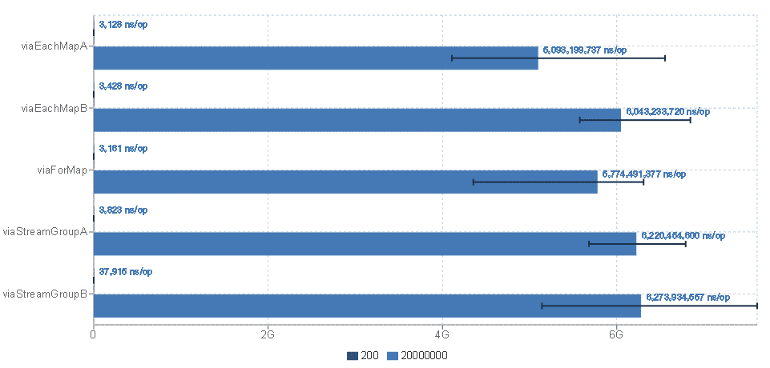
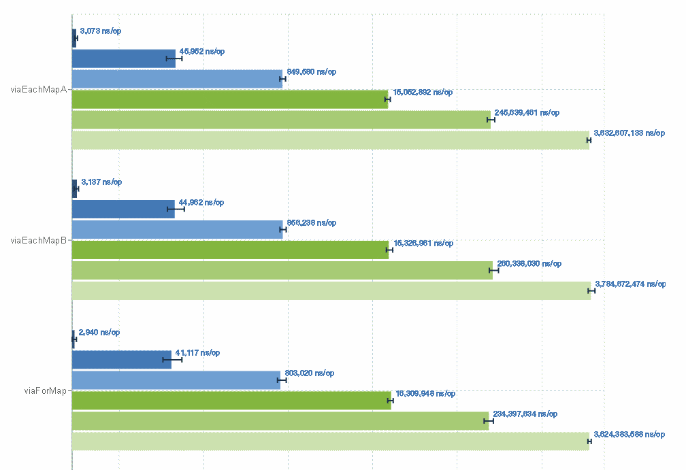
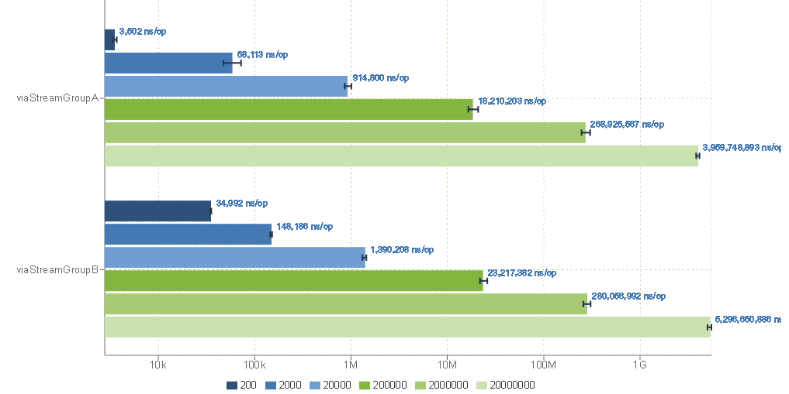
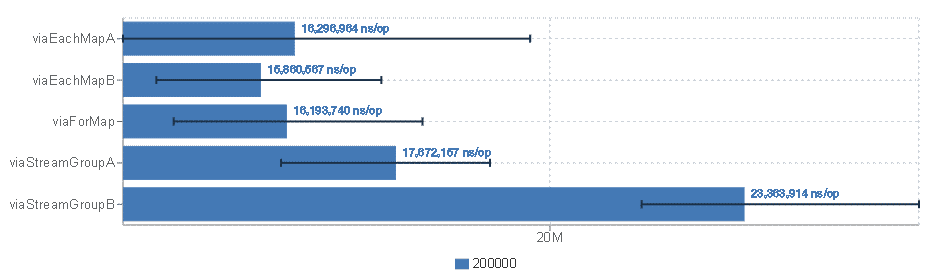

# группировка данных используя Java Stream API

## Формулировка задачи

дан список элементов Music(см.класс mil.teng.sobes03.music.Music) - каждый
элемент содержит:

- author - имя автора
- name - название мелодии

см. [код класса](#data-class-music)

## Вывод

при больших объемах данных и простом алгоритме обработки, использование
Stream замедляет работу.

## Что делает код теста (MusicLargeTest)

1. подготовка списка мелодий
    1. формируется список авторов - фиксированное значение 30 шт. со случайными именами
    1. в параметре теста указан maxMelody - число мелодий
    1. генерируется список musicList - каждый элемент это Music со случайным автор,
        выбранным из списка и случайным названием мелодии на базе UUID
1. для каждого из [алгоритмов](#sort-algorithms) выполняется прогон тестов с
    параметрами, указанными в аннотациях класса MusicLargeTest. а именно:
    1. задание параметров JVM и чилс повторений в виде отдельных процессов

    ```java
    @Fork(value = 5, jvmArgs = { "-Xms6G", "-Xmx6G" })
    ```

    число 5 - означает, что последовательно будет создано 5 процессов, каждый из
    которых выполнит вначале стадию Warmup, а затем Measurement

    1. Warmup. "итерация" прогрева выполняется 10 раз. каждая "итерация" занимает
    до 20 секунд. Сколько будет вызван код метода - не определено. Определяется
    только суммарное время выполнения на 1 итерацию

    ```java
    @Warmup(iterations = 10, time = 20, timeUnit = TimeUnit.SECONDS)
    ```

    1. Measurement. "итерация" измерения.  выполняется 10 раз. каждая "итерация"
    занимает до 20 секунд. Сколько будет вызван код метода - не определено.
    Определяется только суммарное время выполнения на 1 итерацию

    ```java
    @Measurement(iterations = 10, time = 20, timeUnit = TimeUnit.SECONDS)
    ```

    оценочное время выполнения тестов при таких параметрах - 02ч 47мин
    для 20'000 мелодий

## Что делает код UnitSortA4M4Test (1-MusicA4M4SortTest.cmd)

Код предназначен для проверки корректности используемых алгоритмов. Для зафиксированного
в коде списка авторов и мелодий выполняется каждый алгоритм его результат сравнивается
с ожидаемым

## Что делает код DebugRusConsole (5-DebugRusConsole.cmd)

Код нужен для отработки корректности вывода русских букв для разных вариантов кодировки консоли
пояснение: кодировку можно задавать как в рамках аннотации Fork/jvmArgs так и непосредственно в запускающем скрипте
```bat
java -jar target/benchmarks.jar -jvmArgs "-Dfile.encoding=cp866" ".*DebugRusConsole"
```

## Инструкция по сборке и запуску

## <a id="sort-algorithms" />Алгоритмы реализации

Было реализовано пять алгоритмов. полный код см. в mil.teng.sobes03.music.SortAlgorithms

кратко:

- makeSortViaStreamGroupA - исходный список превращается в Stream, группируется
    через groupingBy
- makeSortViaStreamGroupB - идентично makeSortViaStreamGroupA, но Stream
    распараллеливается
- makeSortViaEachMapA - исходный массив перебирается через forEach. Каждый
    элемент оценивается отдельно и складывается во внешний HashMap.
    computeIfAbsent не применяется
- makeSortViaEachMapB - исходный массив перебирается через forEach. Каждый
    элемент оценивается отдельно и складывается во внешний HashMap.
    computeIfAbsent применяется
- makeSortViaForMap - исходный массив перебирается через цикл for(i1=...).
    Каждый элемент оценивается отдельно и складывается во внешний HashMap.
    computeIfAbsent не применяется. Максимально прямолинейный код

## <a id="data-class-music" /> Класс Music

```java
public final class Music {
    private final String author;
    private final String name;

    public Music(String author, String name) {
        this.author = author;
        this.name = name;
    }

    public String getAuthor() {
        return author;
    }

    public String getName() {
        return name;
    }

    @Override
    public String toString() {
        return "Music{" + "author='" + author + '\'' + ", name='" + name + '\'' + '}';
    }
}
```

## Результаты

оригинальные файлы данных JMH-тестов см. в папке [reports](reports)

визуализация через [https://jmh.morethan.io/](https://jmh.morethan.io/)

### MusicLargeTest-20kk

ключевые параметры:

- Warmup: 3 iterations, 5 s each
- Measurement: 3 iterations, 5 s each
- maxMelody=200,20000000
- total-time=00:53:41



для 20'000'000 элементов

самый быстрый алгоритм (f) - viaEachMapA, 5093,20 ms

самый медленный алгоритм (s)- viaStreamGroupB, 6273,93 ms

потери (s-f)*100/f = 23%

### MusicLargeTest-A

- Warmup: 5 iterations, 15 s each
- Measurement: 5 iterations, 15 s each
- maxMelody=200,2'000,20'000,200'000,2'000'000,20'000'000
- total-time=07:04:58




для 20'000'000 элементов

самый быстрый алгоритм - viaForMap, 3624,38 ms

самый медленный алгоритм - viaStreamGroupB, 5296,65 ms

потери = 46%

### MusicLargeTest-B

- Warmup: 7 iterations, 30 s each
- Measurement: 7 iterations, 30 s each
- maxMelody=200'000
- total-time=02:55:42



самый быстрый алгоритм - viaEachMapB. 15,86 ms

самый медленный алгоритм - viaStreamGroupB, 23,36 ms

потери=47%
